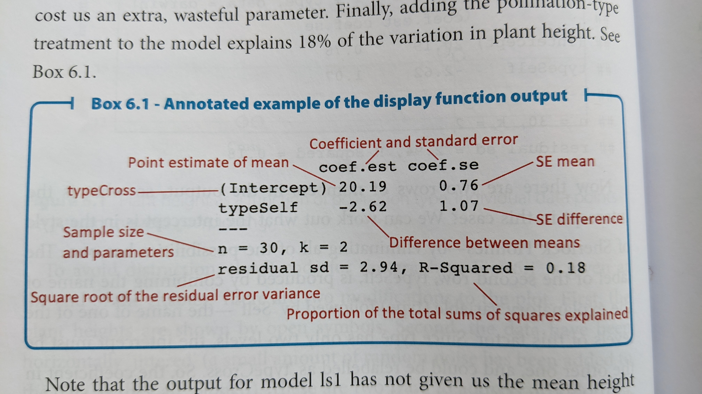

```{r setup, include=FALSE}
knitr::opts_chunk$set(echo = TRUE)
library(dplyr)
library(ggplot2)
library(arm)
darwin_maize <- read.csv(here::here("data/darwin_maize.csv"))
```

# About  
This lab introduces the analysis of data using a linear model framework. It closely follows chapter 6 in *The New Statistics With R* 2nd ed. by Andy Hector. 

### Packages  

For this lab, we will be using the `dplyr`, `ggplot2`, and `arm` packages. Make sure all packages are installed on your computer, and then run the following code:

```{r, eval=FALSE}
library(dplyr)
library(ggplot2)
library(arm)
```

## Data  

For this lab, we will be using data from an experiment that Charles Darwin performed on the effects of self-pollination on *Zea maize* plants. Darwin was interested in determining if high genetic diversity also led to more healthy plants, and it is assumed that self-pollinated plants will have lower genetic diversity  Briefly, Darwin was interested in whether or not there was a difference in fitness of seeds which were produced from self- or cross-pollinated plants. Here, the height of the plants was used as a surrogate for fitness. 

We will be using the `darwin_maize.csv` data, which you can download from D2L. Be sure to put it into your `data/` folder. When we read in the data, we will assign it to the object called `darwin_maize`. 

```{r load-data, eval=FALSE}
darwin_maize <- read.csv("data/darwin_maize.csv")
```

Let's take a brief look at the data:

```{r}
names(darwin_maize)
dim(darwin_maize)
head(darwin_maize)
```

* This data contains 30 observations in 4 columns.  
* The variables we are concerned with are the `type` and `height`  
* The `pot` and `pair` variables are grouping variables which we will ignore for now but will discuss in a future lab. 

You can check to see which values appear in the `type` variable with the following code. Note that these return the same values but in different formats.  

```{r}
distinct(darwin_maize, type) # returns data frame
unique(darwin_maize$type) # returns a vector
```

# Linear Models  

Before, we calculated means, standard deviations, and standard error of the means by hand or with `dplyr` functions (`summarise()` and `mutate()`). Now, we are going to adopt a linear model approach and use the `lm()` function (lm stands for "linear model"). 

In the most basic case, we can use the `lm()` to calculate an "intercept-only" model. Essentially this is just calculating the grand mean of our response variable within the data. Before we get into the `lm()` function, let's plot our response variable. We are going to ignore the grouping variables, and here we will set `x = 0` to illustrate the "intercept-only" aspect:

```{r}
ggplot(darwin_maize,
       aes(y = height,
           x = 0)) +
  geom_point() +
  theme_bw()
```

We can see there's lots of variation in the observations (*y-axis*). Our estimate for the global intercept will just be the average response of these data points. 

## Intercept-only model with `lm()`  

Now let's use the `lm()` function to calculate a linear model. The `lm()` function is a bit different from most of the functions we've seen so far. Namely, the first argument it takes is a `formula`, and we need to specify the object we want to perform the model on with the `data` argument. Likewise, the output it returns is a special type of `list` called an `lm`, so we will need to store the output in a new object. 

I'm going to call this object `dlm0` which stands for "darwin linear model 0".  

```{r}
dlm0 <- lm(formula = height ~ 1,
           data = darwin_maize)
```

The first argument is a formula. It has the general syntax of `response_variable ~ predictor_variable`. Here, the response we're interested in is `height`. For this simple model, we are ignoring all predictor variables and just calculating an intercept. However, R doesn't know how to deal with an incomplete formula, so we put a `1` in as a place holder. 

The new object we created is a list. Lists are complex data structures which can hold many different types of data. We will get into the specifics of these later, but for now just run the following code to get an idea of the general structure of the `lm()` output. 

```{r}
is.list(dlm0)
class(dlm0)
names(dlm0)
```

Because the output is a complex data type, we will rely on a special function to summarize the output and give us the values we are interested in for now. (In the future we will be interested in other values, such as p-values, so will use different functions later.)  

We will use the `display()` function from the `arm` package. Make sure you ran the `library(arm)` call at the top of this lab. If you try and run the code below and get an error, it's likely that the package was not properly installed or loaded. 

```{r}
display(dlm0)
```

This output is called a *table of coefficients*. There is a row for each coefficient (in this case, just the intercept) and the columns show the estimate as well as the standard error of the estimate.  

Coefficient tables in R always list the first coefficient as the intercept, and it can be sometimes tricky to figure out what it's actually referring to. In this case, we can confirm it's the global average by using the `mean()` function, either on it's own or with `dplyr`:

```{r}
mean(darwin_maize$height)
darwin_maize %>%
  summarize(global_avg = mean(height))
```
The number of observations is displayed in the table of coefficients as `n`, and the number of parameters estimated is shown with `k`. It also shows us the $R^2$ value, tells us how much variation is explained based on the predictor variables used in our model. $R^2$ values range from 1 (perfect explanation) to 0 (no explanation). In this case we don't have any predictor variables, so the intercept only model explains 0% of the variation in the response variable.   

The table also shows us the residual standard deviation, which in this case is the same as using `sd()` since we are ignoring group-levels. 
```{r}
sd(darwin_maize$height)
```
### **You should now be able to complete problem 1 in the homework assignment**

## Model with a categorical predictor  

The intercept-only model is useful for showing what the `lm()` function does but is rarely of interest in an analysis framework. Let's examine a slightly more complex model where we use the `type` variable as a predictor. 

But first, let's plot the data separated by `type`. 

```{r}
ggplot(darwin_maize,
       aes(x = type, 
           y = height, 
           color = type)) +
  geom_point() +
  theme_bw()
```

We can now see that the plants which are categorized as `type == Cross` may be taller than the `type == Self` category. Remember that the `Self` plants presumably have lower genetic diversity. This plot looks to confirm the general hypothesis, but let's make one small tweak to the plot in order to show all the individual observations. 

```{r}
ggplot(darwin_maize,
       aes(x = type, 
           y = height, 
           color = type)) +
  geom_point(position = position_jitter(
               width = 0.1, 
               height = 0)) +
  theme_bw()
```

The `poisiotion_jitter()` function adds a little bit of random noise to the points so that they are note plotted right over one another (note that there are now 2 observations in the Cross group at the y-value of 12). In this case, we added a little noise to the x-axis (`width = 0.1`). Because the y-axis is our response variable, we did not add any noise (`height = 0`) to it to avoid masking the effect of our predictor variable. 

Now, let's fit the model including the categorical predictor variable into a new object `dlm1` (darwin linear model 1). 

```{r}
dlm1 <- lm(height ~ 1 + type,
           data = darwin_maize)
```

**Note** that when you have predictor variables in the formula the `1` is no longer needed, so running `lm(height ~ type, data = darwin_maize)` will give you the same result. 

Let's display the results of our new model:
```{r}
display(dlm1)
```
The layout of this table is similar as before, but now we have two rows, one called "(Intercept)" and one called "typeSelf". Recall that there are only 2 categories in the `type` variable. Because typeSelf is listed in the table, you would be correct in assuming that (Intercept) is the average height of the plants in the Cross group. 

You might also assume that the `typeSelf` coefficient estimate is the avergae of the other group of plants. However, this coefficient is showing the estimated *difference* in means. So in order to get the mean for the Self group, we need to subtract the estimated difference from the estimate for the Cross group. 

$$ \bar{y}_{self} = \bar{y}_{cross} - \beta_{difference}$$

$$\bar{y}_{self} = 20.19 - 2.62 = 17.57$$



We can add estimates of the group means in ggplot to help us visualize this. 

```{r}
ggplot(darwin_maize,
       aes(x = type, 
           y = height, 
           color = type)) +
  geom_point(position = position_jitter(
               width = 0.1, 
               height = 0)) +
  stat_summary(fun = mean, 
               geom = "point",
               color = "black",
               shape = 8, 
               size = 6) +
  theme_bw()
```


**You should now be able to complete problem 2 in the homework assignment.**

## Standard error of the difference  

The coefficient table above contains estimates of our coefficients as well as standard errors. The standard error for the intercept is calculated the same was the SEM we saw before in class: $SEM = \frac{\sigma}{\sqrt n}$. 

The standard error for the second term is not an SEM but a standard error of the difference between means (SED). The formula for this is:

$$\large SED = \sqrt{\frac{s^2_{1}}{n_1} + \frac{s^2_{2}}{n_2}}$$

However, the linear model doesn't calculate the variance from each group separately but does a more accurate "pooled" calculation. I won't ask you yo do this manually in class, but just know that if you used `var()` on each group and tried to plug it into the formula above you would not get exactly the same result. 

The SED is always wider than the SEM of either group. This is because there is uncertainty in the estimate of each group mean (SEM), and these uncertainties are carried through the calculation of the difference between the means.  

## Confidence intervals of coefficients  

Recall that a 95% CI is approximated by:

$$\large 95\% CI = \bar{y} \pm 2*SEM$$
Similar to the SED calculation above, there is uncertainty in our estimates, our SEM and SED's so we cannot simply multiply these together to estimate a 95% CI. Luckily, there is an R function, `confint()` which specifically calculates confidence intervals for coefficients from linear models. **This function does not work on vectors. It only works on fitted model objects**

```{r}
confint(dlm1)
```
The output of `confint()` is the lower bound (2.5%) and the upper bound (97.5%) of the confidence interval. 

So the 95% confidence interval for the average height of the Cross plants is: `r c(confint(dlm1)[1], confint(dlm1)[3])`, and the 95% CI for the average difference between the two groups is: `r c(confint(dlm1)[2], confint(dlm1)[4])`. 

### Interpretation  

Recall that the hypothesis was that self-pollinating plants were less fit due to lower genetic diversity. What does our data indicate? 

If there was **NO EFFECT** of self-pollination, we would expect the heights of each group to be the same. Or in other words, the difference between the groups would be 0. Because the 95% CI is completely negative (does not include 0), we can be fairly confident that there is a difference in plant height. Because the mean height of the Self-group of plants is lower, we can conclude the difference in height is consistent with the original hypothesis (self-pollinated plants are shorter and therefore less-fit). 

The `arm` package has a nice function for displaying coefficient estimates: `coefplot()`. This function also requires the object to be a model fit (will not work on a vector). 

```{r}
coefplot(dlm1, xlim = c(-5, 0))
```

I added the `xlim = c(-5, 0)` argument to ensure that the plot displayed 0, which is our value of interest. When you're doing this on the homework, you may need to play around with different limits on the x-axis. 

So, at the 95% confidence level, we can say that the there is a decrease in mean plant height in self-pollinated plants. 


We can test this same hypothesis at a higher level of confidence, i.e., 99% CI

### 99% CI and `coefplot()`

We can change the level of certainty in both the `confint()` and `coefplot()` functions with the following. We can calculate a 99% CI directly by adding `level = 0.99` to the `confint()` function. Unfortunately, the `coefplot()` function only allows us to change the level of standard deviation. We can set `sd = 3` to get *approximately* the same values. 

```{r}
confint(dlm1, level = 0.99)
coefplot(dlm1, sd = 3)
```

Notice that at the 99% confidence level (or at 3 * the standard deviation), the interval now crosses 0. In other words, at this more strict level of confidence, we cannot say that there is a difference in height between the two plant groups.  

### **You should now be able to complete problem 3 in the homework assignment. **  

# Assumptions  

It's always important to remember that all models have assumptions, and you should check that those assumptions are reasonably met. The 4 assumptions of a linear model are:

1. Linearity  
2. Normality of residuals  
3. Equal variance (homoscedasticity) of residuals  
  * For categorical data, need to ensure equal variance across groups  
  
  
4. Independence 

Assumption 1 is usually assessed graphically and will be more important when we get to regression analysis (continuous x-variables). For categorical data it is less often tested directly. 

Testing assumption 4 directly is tough, so usually we assess this assumption based on our understanding of how the data were generated and observed. 

For assumptions 2 and 3, even with categorical data, we can assess with graphs. 

For assumption 2, normal distribution of residuals, we use a Q-Q plot which shows our standardized residuals compared with our theoretical quantiles. We can do this using `ggplot()`. **NOTE** the `aes()` function has an argument called `sample`. We do not use an x or y argument. 

```{r}
ggplot(darwin_maize, aes(sample = height)) +
    stat_qq() + # plot qq points
    stat_qq_line() # reference line
```

If the residuals were perfectly normal, all the points would be exactly on the line. Here, the data in the middle fit pretty well, but the observations at the extreme ends are rather far off the line. Luckily, linear models are fairly robust to this assumption. In this case, it doesn't look perfect, but it's not terrible. We will discuss how to deal with non-normal residuals in the future. 

For assumption 3, equal variance of residuals, we can compare the fitted model values with the residuals. For this we can again use `ggplot()`, however, this time we are plotting the model object, not the raw data directly. Note that I once again added a "jitter" argument to the width (x-axis) to help visualize the individual points but did not modify the position on the height (y-axis)

```{r}
ggplot(dlm1,
       aes(x = .fitted, y = .resid)) +
    geom_point(
      position = position_jitter(
        width = 0.1,
        height = 0)) +
    geom_hline(yintercept = 0)

```

What we are looking for here is that the minimum and maximum y-values are the same across the x-values, and that they are approximately equally distributed above and below the reference line (y = 0). 

Here, we have a few points that are well below the rest (difference in range), and it appears to be unequal (most points above the 0 reference line). Similar to the results above, this is not perfect, but also not terrible. 

When we have categorical predictors, we also want to ensure that the variance between groups is approximately the same. We can do this with a boxplot of the groups. 

```{r}
ggplot(darwin_maize,
       aes(x = height,
           y = type)) +
  geom_boxplot()+
  labs(title = "Example of approx. equal variances across groups")
```
Here, the widths of the boxplots are approximately equal which means that each group has approximately the same observed variation. The dots on the left side for each group are not ideal, but this doesn't look too concerning. 

What would be concerning is if the widths of the boxes were different sizes. For example:

```{r, echo = FALSE}
set.seed(2112)
df <- data.frame(x = c(rnorm(10, 10, 1), 
                       rnorm(10, 20, 10)), 
                 group = rep(c("A", "B"), each = 10))
ggplot(df, 
       aes(y = group, 
           x = x)) +
  geom_boxplot() +
  labs(title = "Example of unequal variances across groups")
```


### **You should now be able to complete problem 4 in the homework assignment. **  


## Relevelling the groups

We can modify the data to estimate the mean and SE for the other plant group (`Self`). Right now, the `type` column is a character datatype. 

```{r}
class(darwin_maize$type)
```

The default behavior for R is to treat characters alphabetically. We can change this by setting the class of `type` to a factor and designate the levels or orders of that factor. I will first make a new object called `darwin_factor`, which will be an exact copy of `darwin_maize`. I will then change the class of the `type` variable directly.  

```{r}
# copy the data object
darwin_factor <- darwin_maize

# change the class of the type column
# and set the levels
darwin_factor$type <- factor(
  darwin_factor$type,
  levels = c("Self", "Cross"))

# what is the class of the new type column?
class(darwin_factor$type)
# what are the order of the levels?
levels(darwin_factor$type)
```

Finally, we can perform the same linear model analysis as above with the `Self` group as our reference level. 
```{r}
display(lm(height~type, data = darwin_factor))
```
Now we can see that the estimate and SE for the Intercept coefficient are different. Likewise the second row of the table now says `typeCross` instead of `typeSelf`. 

### Coda

You should now be able to complete the homework for introduction to linear models. 