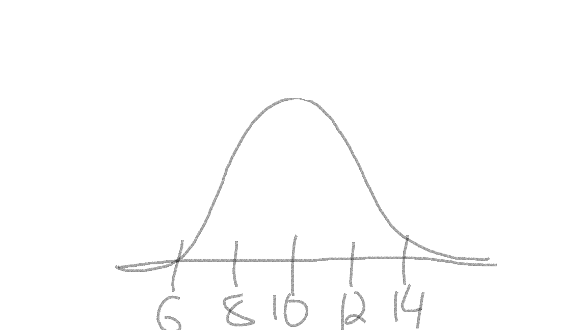
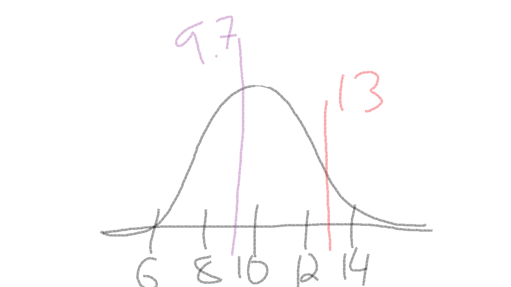
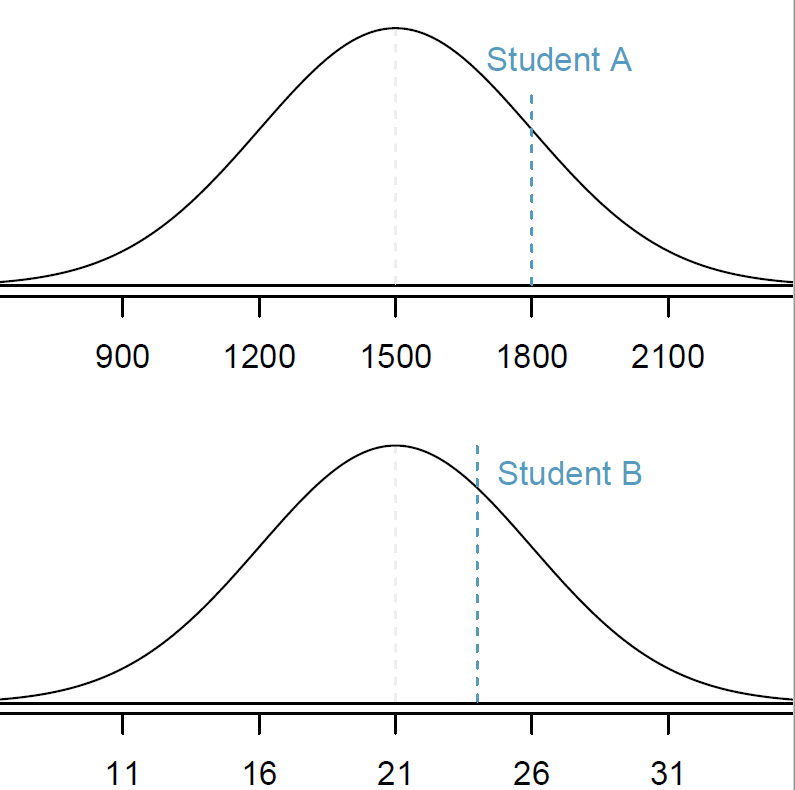

```{r setup, include=FALSE}
knitr::opts_chunk$set(echo = TRUE)
library(tidyverse)
```


# Why do we care about how numbers are distributed?

Let's stop and take a step back. What is the purpose of statistics? Well, there're lots of reasons for statistics. But the one that I most often think of is "what should we expect to see when we measure something?" What values are normal (expected)? What values are *unexpected*? When we measure things there is often lots of *noise* or variation in the values we get. But somewhere, buried in that noise is the *signal*. Most often, we are interested in detecting the signal. 

Let's take an example. If I asked you what the average height of a human being is, you'd probably have an answer. Maybe somewhere between 5'6" and 5'10" (167-178 cm) depending on if you were thinking about averages within or among the sexes. Perhaps you're estimate would be slightly different if you were from a place where most people are taller or shorter than the average. However, I'm willing to bet (and I'm not even a betting man) that you *didn't* say the average around the world was 4 or 7 feet (122 or 213 cm). Meeting an individual who is 4 or 7 feet may not be overly surprising, but meeting someone who was 2 or 10 feet (61 or 305 cm) would likely be very surprising (excepting of course children on the low end of the scale). 

This is where understanding how numbers are distributed comes in really handy. All of us probably have a decent idea of how tall we would expect a new person we meet would be. We might not know *exactly* how tall a new acquaintance will be, but there are certain heights which would surprise us. 

This is essentially true for anything we might want to measure: the number of plants in a field; the biomass of trees in a forest; the amount of CO~2~ emitted from burning a gallon of gas. Most of us probably have very little idea of what we should expect if we measured these. If you burned a gallon of gas and measured 10,000 grams of Carbon, would you be surprised? Flabbergasted? Pretty chill about it? 

# Describing the Normal Distribution

The normal distribution, also called a Gaussian distribution, or the "bell curve" is probably somewhat familiar to you. It is a symmetric distribution that is centered near the mean (AKA average). The mean is generally represented with the greek letter $\mu$ (mu). $\mu$ determines where on the number line a given normal distribution falls. For example, here are four identical normal distributions which only vary in their means, or where they occur on the number line:

```{r, echo = FALSE}
set.seed(3987)
y1 <- rnorm(10000, sd = 2,mean = 0)
y2 <- rnorm(10000, sd = 2,mean = 10)
y3 <- rnorm(10000, sd = 2,mean = -5)
y4 <- rnorm(10000, sd = 2,mean = -20)

ydf <- data.frame(y = c(y1, y2, y3, y4),
           mean = rep(c("0", "10", "-5", "-20"), each = 10000)) 

ggplot(ydf, aes(x = y,
                group = mean,
                fill = mean)) +
  geom_density(alpha = 0.5, adjust = 2) +
  theme_bw() +
  labs(caption = "Figure 1. Normal distributions with the same SD but different means")
```

How wide the bell curve is is described by its standard deviation. The standard deviation is generally represented with the greek letter $\sigma$ (sigma). In the previous example the standard deviations were all identical. The following graph shows two normal distributions with identical means, but with different standard deviations. 

```{r, echo=FALSE}
set.seed(3987)
x1 <- rnorm(10000, 8887, 500)
x2 <- rnorm(10000, mean = 8887, sd = 100)
df <- data.frame(x = c(x1, x2),
                 grp = rep(c("big SD", "small SD"), each = 10000))

ggplot(df, aes(x = x,
               group = grp,
               fill = grp)) +
  geom_density(alpha = 0.5) +
  labs(x = "co2",
       caption = "Figure 2. Normal distributions with the same mean but different SDs") +
  theme_bw() 
```

We describe normal distributions with the following mathematical notation:

$$\Large X \sim \text{Normal} (\mu,~ \sigma)$$

The way you would read this is "x is normally distributed with a mean of mu and a standard deviation of sigma". 

Note that $Normal()$ in the equation above is sometimes abbreviated to $N()$.  

The above example shows the general format of writing out a normal distribution. We usually specify the value of $\mu$ and $\sigma$ when it is known. For example, here is how we would write it out the distribution for a variable $y$ with a a mean of 65 and a standard deviation of 10:

$$\Large y \sim \text{N} (\mu = 65,~ \sigma = 10)$$

# Density plots and probability

When we are looking at density plots, one of the main things we're looking for is how likely or unlikely are a give

# The Empirical Rule

Another important aspect of the standard deviation, is that multiples of it describe where different majorities of the data lie. For example, the mean + and - 1 standard deviation contains about 68% of the total observations ($\mu \pm \sigma$). Likewise, 95% of the observations are within 2 standard deviations ($\mu \pm 2\sigma$) and 99.7% are within 3 standard deviations ($\mu \pm 3\sigma$). This is called the Empirical Rule and can be represented in a graph as so:


{width=70%}

When working with normal distribution problems, one of the first things you should do is sketch a graph. Draw a bell curve on a number line. Make sure to center the curve at the mean, and then write out a couple of standard deviations to either side. For example, if we have a normal distribution with `mean = 10` and `sd = 2`, you should immediately draw out something like this: 




The curve is centered at our mean of 10 (tallest part of the "bell"), and I added a few marks indicating 1 and 2 standard deviations away from the mean: $10 \pm 2 = (8, 12)$ and $10 \pm 2*2 = (6, 14)$. 

Then, you can quickly sketch where a give observation would fall on the distribution. For example, if we had an observation of 9.7 and 13, I would quickly add them to the sketch:




Doing this can be a quick estimate of where the observations fall, and can help us to check our answers (more below). 

# CO~2~ from a gallon of gas

Let's return to our example of measuring 10,000 grams of CO~2~ from burning 1 gallon of gas. Let's say that the grams of CO~2~ from 1 gallon of gas can be described as being normally distributed with a mean of 8887, and a standard deviation of 500 [^1].

Mathematically, we would write this as: $$\large CO_{2} \sim {Normal}(\mu = 8,887,~ \sigma = 500)$$ 

Using this information, let's apply the empirical rule to quickly write out the values that bound 68% of the data. Recall that 68% of the data falls within 1 SD of the mean. In R we could calculate this in a couple of different ways::

```{r}
# lower bound; mean - sd
8887 - 500
# upper bound; mean + sd
8887 + 500

# combine it in one line using c()
c(8887 - 500, 8887 + 500)
```

A graph of the full distribution would look something like this (note that I'm switching to graphics made in R for accuracy, but when you are working on problems a quick sketch by hand can do wonders)

```{r, echo=FALSE}
ggplot(data.frame(x = x1), aes(x)) +
  geom_density() +
  labs(x = "co2",
       caption = "Figure 6. Hypothetical distribution of grams of CO~2~ emitted from burning one gallon of gas.") +
  theme_bw()
```


[^1]:The mean estimate of 8,887 grams was taken from the US [EPA website](https://www.epa.gov/greenvehicles/greenhouse-gas-emissions-typical-passenger-vehicle#:~:text=Every%20gallon%20of%20gasoline%20burned%20creates%20about%208%2C887%20grams%20of%20CO2.) and the standard deviation of 500 grams was made up because I couldn't find a good estimate online.

Now, let's add an arrow to show where our measurement of 10,000 lands:

```{r, echo=FALSE}
ggplot(data.frame(x = x1), aes(x)) +
  geom_density() +
  labs(x = "co2",
       caption = "Figure 7.") +
  theme_bw() +
  annotate("segment",
           x = 10000,
           xend = 10000,
           y = 2e-04,
           yend = 0,
           color = "red",
           arrow = arrow(length = unit(0.05, "npc")))
```

Based on this information, we might think that an observation of 10,000 grams of CO~2~ might be pretty unlikely. We can go a step further, however, and measure the exact probability of getting a measurement at this magnitude. 

For this, we can use some functions built in to R to describe the normal distribution. These functions are `dnorm()`, `pnorm()` and `qnorm()`.

### Endnotes {#endnotes}

# Normal Distribution functions

Notice that all three functions have the form of `_norm()` which indicates that we are working with a normal distribution. There are functions for other distributions, which we may get to later this semester. The `_` is either a `p`, `d`, or `q`, which gives us different functions of the normal distribution according to the following:

* `d` = density function

* `p` = probability distribution function

* `q` = quantile function

Each of these are used to answer a specific question. 

* `dnorm()`: what is the probability of sampling a specific number?

* `pnorm()`: what is the probability of sampling *up to* a specific number?

* `qnorm()`: what number represents a specific quantile of the data?

## Probability of an *exact* number: `dnorm()`

So, what is the probability of measuring exactly 10,000 from our distribution? To do this, we use the `dnorm()` function. the first argument is the number that we are interested in `10000`. The next two arguments are named, and they are where we describe what type of normal distribution we are working with. Recall above that we said this normal distribution is described by `mean = 8887` and `sd = 500`. Putting it all together the function call looks like this:

```{r}
dnorm(10000, mean = 8887, sd = 500)
```
So the probability of measuring 10,000 from this distribution is only 0.0067%. That is a vanishingly small number. I guess we should be flabbergasted by this measurement. But let's take a step back, that is the probability of measuring *exactly* 10,000 grams of CO~2~. The probability of measuring any number exactly is usually pretty small, even the average:

```{r}
dnorm(8887, mean = 8887, sd = 500)
```
That's only a 0.08% chance of measuring *exactly* the mean. 

## Probability of more-or-less than a value: `pnorm()`

Usually, we're interested in the probability of getting an observation which is smaller or greater than our value of interest. For example, what's the probability of measuring up to 10,000 grams of CO~2~? For this, we use `pnorm()`:

```{r}
pnorm(10000, mean = 8887, sd = 500)
```
98.7% chance. Or, in other words, 98.7% of the data is *smaller* than 10,000. 

The default for the `pnorm()` function measures the probability of getting *up to* our value of interest. In other words, it is measuring the area under the curve to the left of our value. 

```{r area-shade-left-plot, echo=FALSE}
breaks <- c(-Inf, 10000, Inf)
ggplot(data.frame(x = x1), aes(x)) +
  geom_density() +
  scale_fill_manual(values = c("dodgerblue", "grey")) +
  stat_density(
    n = 500,
    geom = "area",
    colour = "black",
    aes(
      fill = after_stat(x) %>% cut(!!breaks),
      group = after_scale(fill)
    )
  ) +
  #scale_y_continuous(limits = c(0,0.8e-02)) +
  theme_bw() +
  theme(legend.position = "none") +
  labs(caption = "Figure 8. Area shaded to the left of our value (in blue)")
```

What if we wanted to look at the area under the curve to the right of our value? Or what the probability of measuring a value greater than our value of interest?

```{r area-shade-right-plot, echo=FALSE}
breaks <- c(-Inf, 10000, Inf)
ggplot(data.frame(x = x1), aes(x)) +
  geom_density() +
  scale_fill_manual(values = c("grey", "dodgerblue")) +
  stat_density(
    n = 500,
    geom = "area",
    colour = "black",
    aes(
      fill = after_stat(x) %>% cut(!!breaks),
      group = after_scale(fill)
    )
  ) +
  #scale_y_continuous(limits = c(0,0.8e-03)) +
  theme_bw() +
  theme(legend.position = "none")+
  labs(caption = "Figure 9. Area shaded to the right of our value (in blue)")
```

We can calculate this probability by modifying our code in 2 ways. 

```{r}
# first way
1 - pnorm(10000, mean = 8887, sd = 500)
# second way
pnorm(10000, mean = 8887, sd = 500, lower.tail = FALSE)
```

In the first example, we take advantage of the fact that the entire area under the curve has to sum to 1. This is because the complete area under the curve represents 100% of all probabilities. So since our original code was calculating the area to the left, then the area to the right has to be equal to one minus that area. 

In the second way, we add an argument `lower.tail = FALSE` to change the default of `pnorm()`, and have it measure the area to the right. 

We can combine this information to calculate the probability of getting a measurement between 2 values, let's say between 9,000 and 10,000. 

```{r area-shade-between-plot, echo=FALSE}
breaks2 <- c(-Inf, 9000, 10000, Inf)
ggplot(data.frame(x = x1), aes(x)) +
  geom_density() +
  scale_fill_manual(values = c("grey90", "dodgerblue", "grey50")) +
  stat_density(
    n = 1500,
    geom = "area",
    colour = "black",
    aes(
      fill = after_stat(x) %>% cut(!!breaks2),
      group = after_scale(fill)
    )
  ) +
  #scale_y_continuous(limits = c(0,0.8e-03)) +
  theme_bw() +
  theme(legend.position = "none")+
  labs(caption = "Figure 10. Area shaded between values (in blue)")
```

To calculate this, we need to make two calls using the `pnorm()` function. In the first, we calculate the probability from the left to our maximum value of interest: `pnorm(10000, mean = 8887, sd = 500)`. This gives us the area of the light grey (to the left) and the blue shaded regions in the figure above. 

Then, we need to calculate the area of the lighter grey region using `pnorm(9000, mean = 8887, sd = 500)` and subtract that from the area calculated above. In R, we would type the following:
```{r}
pnorm(10000, mean = 8887, sd = 500) - pnorm(9000, mean = 8887, sd = 500)
```
Which gives us approximately a 40% chance of observing a value between 9000 and 10,000. 

## What value is a quantile of our data? `qnorm()`

We are often interested in knowing what value breaks off a specific percentage of the data. For example, above we found out the ~98.7% of our data was smaller than 10,000, but we might be interested in knowing what value marks the 95th percentile, or the 1st, or the 30th, etc. Luckily, this is exactly what the `qnorm()` function is for. Once again, this function takes our value of interest as the first argument, and then names arguments for the `mean` and `sd` which describe our distribution. 

Using our example above, we can ask what specific value marks the 95th percentile: 
```{r}
qnorm(0.95, mean = 8887, sd = 500)
```
Likewise, we can supply multiple numbers in the first argument using the `c()` function. For example, if we want to know what values mark the 10th, 20th, 80th and 90th percentiles, we can enter the following: 
```{r}
qnorm(c(0.1, 0.2, 0.8, 0.9), mean = 8887, sd = 500)
```

# The Standard Normal Distribution

The standard normal distribution (often call the Z-distribution) is a special case where `mean = 0`, and `sd = 1`. This distribution has a few special features which are helpful when we are thinking about data. Recall that approximately 68% of the data falls within one standard deviation of the mean, and 95% and 99.7% fall within 2 and 3 sd's respectively. Because the standard normal distribution has `sd = 1`, it makes it very easy to estimate where an observation lands within the distribution. 

```{r, echo=FALSE}
sn_int <- data.frame(
  qnt = c("68%", "95%", "99.7%"),
  low = c(-1, -2, -3),
  hi = c(1, 2, 3)
)
knitr::kable(sn_int, "html", col.names = c("Percentage", "Min Value", "Max Value") , align = "c")
```


For example, if I tell you that I observed a value of 0.25 from a standard normal distribution, you can quickly surmise that it is within 68% of the data (0.25 falls within the range of `(-1, 1)`). In other words, this is an expected value which is close to the mean. 

What if I told you I measured a value of -3.7 from a standard normal distribution? What would your initial thought be? If you refer back to the table, you should see that 99.7% of the data falls between `(-3, 3)`, so a value of -3.7 (i.e., less than -3) is in the extreme left tail of the distribution. 

So far, we have been playing around with a (made up) distribution of CO~2~ emissions from burning a gallon of gas, which can be described with `mean = 8887` and `sd = 500`. You can use the same rules above to determine if a value is within so many SD's of the mean by using ranges of the mean minus x * the standard deviation:

```{r, echo=FALSE}
sn_co2 <- data.frame(
  qnt = c("68%", "95%", "99.7%"),
  low = c(8887 - 500, 8887 - 2*500, 8887 - 3*500),
  hi = c(8887 + 500, 8887 + 2*500, 8887 + 3*500)
)
knitr::kable(sn_co2, "html", col.names = c("Percentage", "Min Value", "Max Value") , align = "c")
```

So if I told you I had a measurement of 7,500, you could use the above table to quickly estimate that it is somewhere within 95 to 99.7% of the data, or in the left tail of the distribution. 

However this is less intuitive then using the standard normal distribution. Likewise, it requires a bit of mental math, can be time confusing and is prone to error. Luckily, there is a method for standardizing any normal distirbution into the standard normal distribution using Z-scores. 

## Z-scores

An amazing feature of normal distributions is that you can transform any one of them into a standard normal distribution. This is accomplished using the following equation:  

$$\Large z = \frac{x_{i} - \mu} {\sigma}$$

where $z$ is the standardized score, $x_{i}$ is the observation from your data and $\mu$ and $\sigma$ are the mean and sd of the data, respectively. 

Let's calculate the standardized z-score of our CO~2~ observation. 
```{r}
# observation = 10000
# mean = 8887
# sd = 500
(10000 - 8887) / 500
```
This value is greater than 2, so falls somewhere between the 95 and 99.7% of the data distribution. 

## Comparing observations using z-scores

The benefit of using z-scores becomes apparent when we want to compare observations from two different distributions. For example, let's compare student scores from two different common standardized tests: the ACT and the SAT. 

The distribution of test scores on the SAT and the ACT are both nearly normal, but are on different scales. The SAT ranges from 400-1600, while the ACT ranges from 1-36. 

Suppose that one student scores an 1800 on the SAT (Student A) and another student scores a 24 on the ACT (Student B). Which student performed better?

- SAT scores are ${Normal}( \mu = 1500, \sigma = 300)$  
- ACT scores are ${Normal}(\mu = 21, \sigma = 5)$  

- $x_A$ represents the score of Student A; $x_B$ represents the score of Student B.  

\[Z_{A} = \frac{x_{A} - \mu_{SAT}}{\sigma_{SAT}} = \frac{1800-1500}{300} = 1 \]  


\[Z_{B} = \frac{x_{B} - \mu_{ACT}}{\sigma_{ACT}} = \frac{24 - 21}{5} = 0.6\]  


Student A has a z-score of 1, which is higher than the z-score for student B of 0.6. So student A was further away from the mean then student B and because the value was positive it's closer to the right side of the distribution. In other words, student A performed better than student B. 

{width=50%}

## Log-Normal Distribution  

Let's look at an example of a non-normal distribution.  

Run the following code to make this plot:

```{r}
set.seed(987) # for reproducibility
x_ln <- rlnorm(1000) # sample 1000 observations from a log-normal distribution 

# plot the values
plot(density(x_ln))

```

We can see that this is a highly skewed data set; lots of observations on the left side (peak) with a very few observations of really large numbers. 

## Transformations  

There are a number of transformations that we can perform on the data to make the observations normally distributed. For example, the log-normal distribution is one that becomes normal after we log transform it. Run the following:

```{r}
x_tranformed <- log(x_ln)

plot(density(x_tranformed))
```

We can see now that the distribution is approximately normal. We will discuss other transformations as they come up in class later.  


[Other examples of non-normal data and transformations](https://www.datanovia.com/en/lessons/transform-data-to-normal-distribution-in-r/) positive and negativer skew

# Coda  

You should now be able to complete HW 02 Normal Distributions  

# Appendix
## Exampe code for figures

### Figure 1
```{r fig-1-code,eval=FALSE}
# Set random number generator seed
# makes results reproducible
set.seed(3987)
# simulate 4 data sets with same mean, different SD
y1 <- rnorm(10000, sd = 2,mean = 0)
y2 <- rnorm(10000, sd = 2,mean = 10)
y3 <- rnorm(10000, sd = 2,mean = -5)
y4 <- rnorm(10000, sd = 2,mean = -20)

# combine data into one data.frame (i.e., a table)
ydf <- data.frame(y = c(y1, y2, y3, y4),
           mean = rep(c("0", "10", "-5", "-20"), each = 10000)) 

# make plot
ggplot(ydf, aes(x = y,
                group = mean,
                fill = mean)) +
  geom_density(alpha = 0.5, adjust = 2) +
  theme_bw() +
  labs(caption = "Figure 1. Normal distributions with the same SD but different means")
```

### Figure 2

```{r fig-2-code, eval=FALSE}
# make reproducible, and sample data
set.seed(3987)
x1 <- rnorm(10000, 8887, 500)
x2 <- rnorm(10000, mean = 8887, sd = 100)

# combine data into data.frame
df <- data.frame(x = c(x1, x2),
                 grp = rep(c("big SD", "small SD"), each = 10000))

# plot
ggplot(df, aes(x = x,
               group = grp,
               fill = grp)) +
  geom_density(alpha = 0.5) +
  labs(x = "co2",
       caption = "Figure 2. Normal distributions with the same mean but different SDs") +
  theme_bw() 
```

### Figure 7 

```{r fig-7-code, eval=FALSE}
# make plot
ggplot(data.frame(x = x1), aes(x)) +
  geom_density() +
  labs(x = "co2",
       caption = "Figure 7.") +
  theme_bw() +
  # add arrow as an "annotation"
  annotate("segment", 
           x = 10000,
           xend = 10000,
           y = 2e-04,
           yend = 0,
           color = "red",
           arrow = arrow(length = unit(0.05, "npc")))
```

### Figure 8
```{r area-shade-left-plot-code, eval=FALSE}
# this is more complicated
# don't worry if you don'totally follow it

# define intervals to shade
breaks <- c(-Inf, 10000, Inf)

# make base plot
ggplot(data.frame(x = x1), aes(x)) +
  geom_density() +
  scale_fill_manual(values = c("dodgerblue", "grey")) +
  # add shading
  stat_density(
    n = 500,
    geom = "area",
    colour = "black",
    aes(
      fill = after_stat(x) %>% cut(!!breaks),
      group = after_scale(fill)
    )
  ) +
  theme_bw() +
  theme(legend.position = "none") +
  labs(caption = "Figure 8. Area shaded to the left of our value (in blue)")
```

```{js, echo=FALSE}
$(document).ready(function() {
  $('.footnotes ol').appendTo('#endnotes');
  $('.footnotes').remove();
});
```