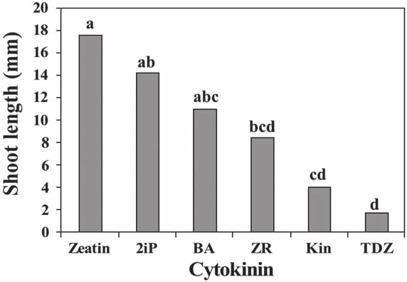

```{r setup, echo = FALSE, include=FALSE}
options(htmltools.dir.version = FALSE)
knitr::opts_chunk$set(echo = FALSE, fig.align = 'center', warning=FALSE, message=FALSE, fig.retina = 2)

library(ggplot2)
library(dplyr)
library(kableExtra)
```

```{r xaringan-themer, include=FALSE, warning=FALSE}
library(xaringanthemer)
style_mono_accent(text_bold_color = "#000000",
  base_color = "#F03297",
  #code_font_google = google_font("Inconsolata", "500"),
  link_color = "#0A0AD3",
  inverse_background_color = "#4C4F57",
  title_slide_background_color = "#4C4F57",
  table_row_even_background_color = lighten_color("#4C4F57", 0.9)
  )
```

class: inverse

# outline

<br/>
#### 1) Overview

<br/>  
--

#### 2) ANOVA as a linear model

<br/> 
--

#### 3) ANOVA table

<br/> 
--

#### 4) Multiple Comparisons

---
# general idea

<br/>
<br/>
<br/>

### Extension of the *t*-test for comparing > 2 populations

---
# motivating example

Ecologists are interested in whether or not tree density changes across elevations. Sample 5 plots (replicates) at 3 elevations (levels).  
.pull-left[
<br/>
```{r echo = FALSE}
pine <- data.frame(
  Replicate = 1:5,
  low = c(16, 14, 18, 17, 20),
  medium = c(10, 11, 15, 9, 12),
  high = c(2, 6, 8, 1, 3))

pine %>%
  kable("html", align = 'c') %>%
  kable_styling(bootstrap_options = c("condensed"), 
                full_width = FALSE, font_size = 18) %>%
  add_header_above(c(" " = 1, "Elevation" = 3))
```
]

--

.pull-right[
#### Notation

- There is a single factor, elevation. 

- The number of groups (AKA treatments, levels) is $\large k=3$ (high, medium, low)

- The number of observations within each group (replicates) is $\large n=5$

- $\large y_{ij}$ denotes the $\large j$th observation from the $\large i$th group
]

---

# motivating example

Are there differences in tree densities at different elevations?

```{r pine1, fig.width=8, fig.height=6}
pine_long <- tidyr::pivot_longer(pine, cols = c(high, medium, low), names_to = "Elevation")
pine_long <- pine_long %>%
  mutate(
    Elevation = factor(
      Elevation,
      levels = c("low", "medium", "high"))) %>%
  arrange(Elevation, -value)
pine_long$x <- c(1,1.1,1.2,1.3,1.4,
                 2,2.1,2.2,2.3,2.4,
                 3,3.1,3.2,3.3,3.4)
ggplot(pine_long, aes(x = x, y = value)) + 
  geom_point(aes(color = Elevation), size = 5) +
  # scale_x_continuous("Elevation", labels = c("high", "medium", "low"), breaks = 1:3) +
  scale_y_continuous("Density") +
  guides(color = FALSE) +
  theme_bw()
```

---
# Hypotheses 

- $\large H_0 : \mu_{low} = \mu_{medium} = \mu_{high}$

- $\large H_a :$ At least one inequality

#### How should we test the null?

--
We could do this using 3 *t*-tests  

<br/>
--
But this would alter the overall (experiment-wise) $\large \alpha$ level because each individual test has a chance (usually $\large \alpha = 0.05$) of incorrectly rejecting a true null hypothesis, and this is multiplied when multiple tests are used  

<br/>
--
An alternative procedure involves comparing the variation among the groups with the variation within the groups. If $H_0$ is false, then the variance among is greater than the variance within groups.

---

# Analysis of Variance: ANOVA

As the name implies, this is a method for partitioning the variance into different components; the *signal* and the *noise*.

--

<br/>
$$\large \frac{\text{signal}}{\text{noise}}$$

--

<br/>
If the treatment (signal) is greater than the variation (noise), we can conclude that there is at least one difference between the groups. 

--

<br/>
To calculate the signal and the noise, we need to calculate the total variation, the among-group variation, and the within-group variation. 

---

# partitioning the variance   

Let's look at all of the observations, ignoring the groups

--

```{r, fig.width=6, fig.height=4}
ggplot(pine_long, aes(x = x, y = value)) + 
  geom_point(size = 5) +
  guides(color = FALSE) +
  labs(y = "Density",
       x = "") +
  theme_bw()

```

---

# partitioning the variance   

Now, let's plot the groups by color, and put a reference line at the global mean ( $\bar{y}.$ ):

```{r, fig.width=6, fig.height=4}
ggplot(pine_long, 
       aes(x = x,
           y = value,
           color = Elevation)) + 
  geom_point(size = 5) +
  guides(color = FALSE) +
  labs(y = "Density",
       x = "") +
  geom_hline(yintercept = mean(pine_long$value)) +
  theme_bw() +
  annotate("text", label = "bar(y)[.]", x = 3.25, y = mean(pine_long$value) + 2.5, 
           parse = TRUE, size = 12)

```

---

# partitioning the variance   

Now, let's add the group means:

```{r, fig.width=6, fig.height=4}

ybari <- pine_long %>%
  group_by(Elevation) %>%
  summarise(y = mean(value)) %>%
  mutate(x = 1:3, 
         label = c("bar(y)[low]", "bar(y)[med]", "bar(y)[high]"))

ggplot(pine_long, 
       aes(x = x,
           y = value,
           color = Elevation)) + 
  geom_point(size = 5) +
  guides(color = FALSE) +
  labs(y = "Density",
       x = "") +
  geom_hline(yintercept = mean(pine_long$value)) +
  theme_bw() +
  annotate("text", label = "bar(y)[.]", x = 3.25, y = mean(pine_long$value) + 2.5, 
           parse = TRUE, size = 12) +
  geom_segment(data = ybari,
               aes(x = x - 0.1,
                   xend = x + 0.5,
                   y = y,
                   yend = y,
                   color = Elevation)) +
  geom_text(data = ybari, 
            aes(x = x+0.5,
                y = y + 1.5,
                label = label), 
            parse = TRUE, size = 5)

```

---

# the sum of squares 

Now that we have our individual observation ( $y_{ij}$ ), our global mean ( $\bar{y}.$ ), and the group means ( $\bar{y}_i$), we can estimate the variance using modified sum of squares equations. 

--

General formula:

$$SS = \sum_i (\text{observation} - \text{mean})^2$$
<br/>

* Recall that the Sum of Squares is also how we calculate variance using the `var()` function

---

# Sums of Squares

Variation among groups (treatment effect, or *signal*).  
  * Group mean - global mean

$$SS_{treatment} = n\sum_i (\bar{y_i} - \overline{y}.)^2$$
--

Variation within groups (*noise*).  

  * group observation - group mean (AKA $SS_{error}$)  

$$SS_{residual} = \sum_j \sum_i (y_{ij} - \overline{y}_i)^2$$
--

Total Variation  

  * observations - global mean

$$SS_{total} = SS_{treat} + SS_{resid} =  \sum_j \sum_i (y_{ij} - \overline{y}.)^2$$
---
# Sums of Squares

Variation among groups: *signal*.  

$$SS_{treatment} = n\sum_i (y_i - \overline{y}.)^2$$
```{r, fig.width=6, fig.height=4}
ggplot(pine_long, 
       aes(x = x,
           y = value,
           color = Elevation)) + 
  geom_point(size = 5) +
  guides(color = FALSE) +
  labs(y = "Density",
       x = "") +
  geom_hline(yintercept = mean(pine_long$value)) +
  theme_bw() +
  geom_segment(data = ybari,
               aes(x = x - 0.1,
                   xend = x + 0.5,
                   y = y,
                   yend = y,
                   color = Elevation)) +
  geom_segment(data = ybari,
               aes(x = x+.25,
                   xend = x+.25,
                   y= mean(pine_long$value),
                   yend = y),
               linetype = 2,
               color = "black",
               size = 1.5)
  

```

---

# Sums of Squares

Variation within groups: *noise*.  

$$SS_{residual} = \sum_j \sum_i (y_{ij} - \overline{y}_i)^2$$
```{r, fig.width=6, fig.height=4}
pine_long$ybari <- rep(ybari$y, each = 5)

ggplot(pine_long, 
       aes(x = x,
           y = value,
           color = Elevation)) + 
  geom_point(size = 5) +
  guides(color = FALSE) +
  labs(y = "Density",
       x = "") +
  geom_hline(yintercept = mean(pine_long$value)) +
  theme_bw() +
  geom_segment(data = ybari,
               aes(x = x - 0.1,
                   xend = x + 0.5,
                   y = y,
                   yend = y,
                   color = Elevation)) +
  geom_segment(data = pine_long, 
               aes(x = x, xend = x, y = ybari, yend = value),
               linetype = 2,
               color = "black",
               size = 1.5
               )
  

```

---


# Sums of Squares

Total Variation  

$$SS_{total} =  \sum_j \sum_i (y_{ij} - \overline{y}.)^2$$
```{r, fig.width=6, fig.height=4}
pine_long$ybari <- rep(ybari$y, each = 5)

ggplot(pine_long, 
       aes(x = x,
           y = value,
           color = Elevation)) + 
  geom_point(size = 5) +
  guides(color = FALSE) +
  labs(y = "Density",
       x = "") +
  geom_hline(yintercept = mean(pine_long$value)) +
  theme_bw() +
  geom_segment(data = ybari,
               aes(x = x - 0.1,
                   xend = x + 0.5,
                   y = y,
                   yend = y,
                   color = Elevation)) +
  geom_segment(data = pine_long, 
               aes(x = x, xend = x, y = mean(pine_long$value), yend = value),
               linetype = 2,
               color = "black",
               size = 1.5
               )
  

```

---

# mean squares

### To covert the sums of squares to variances, divide by the degrees of freedom

--
#### Mean squares among

$$\Large MS_{treat} = \frac{SS_{treat}}{k-1}$$

--
#### Mean squares within

$$\Large MS_{resid} = \frac{SS_{resid}}{k(n-1)}$$

---
# F-statistic

<br/>

$$\large F_{value} = \frac{MS_{treat}}{MS_{resid}}$$

--

### To test the null hypothesis

* Calculate p-value of F-value  
* F-distribution described by two df values  
* `pf(f_val, df1, df2, lower.tail = FALSE)`


---
class: inverse, center, middle

# anova table

---

# anova table

<br/>

```{r anova_tab}
anova_tab <- data.frame(
  Source = c("Among groups", "Within groups", "Total"),
  df = c('\\(k-1\\)', '\\(k(n-1)\\)', '\\(kn-1\\)'),
  SS = c('\\(n \\sum_i (\\bar{y}_i - \\bar{y}.)^2\\)', 
         '\\(\\sum_i \\sum_j (y_{ij} - \\bar{y}_i)^2\\)',
         '\\(\\sum_i \\sum_j (y_{ij} - \\bar{y}.)^2\\)'),
  MS = c('\\(\\frac{SS_{treat}}{k-1}\\)', '\\(\\frac{SS_{treat}}{k(n-1)}\\)', ""),
  F = c('\\(\\frac{MS_{treat}}{MS_{resid}}\\)', "", ""))

anova_tab %>%
  kable(align = 'c', booktabs = TRUE, escape = FALSE, format = "html") %>%
  kable_styling(bootstrap_options = c("condensed"), 
                full_width = FALSE, font_size = 18) 
```


---

# ANOVA table from `lm()` in R

We can fit a linear model in R and use the `anova()` function

```{r, echo=TRUE}
pine_lm <- lm(value ~ Elevation, data = pine_long)
anova(pine_lm)
```

* Calculate F value: 

--

  * $MS_{treat} / MS_{resid} = 212.6 / 6.267 = 33.9$
  
--


* Calculate p-value: 

--

  * `pf(33.925, 2, 12, lower.tail = FALSE)` 


---

# calculate ANOVA table results from `lm()` summary


#### Residuals

- `lm()` also returns residuals (e.g., $y_i - E[y_i]$)

```{r echo = TRUE}
pine_lm$residual[1:5]
```
--

```{r echo = TRUE}
sum(pine_lm$residuals^2)
```

--

- This is the $SS_{residual}$ in the ANOVA table

---

# calculate ANOVA table results from `lm()` summary


#### Residuals

What about among group variation?

```{r echo = TRUE}
pine_lm$fitted.values
```


```{r echo = TRUE}
sum((pine_lm$fitted.values - mean(pine_lm$fitted.values))^2)
```

--

- So the model is the same, the only difference is *how* we present the results

---

# Interpret ANOVA table 

```{r, echo=FALSE}
as.data.frame(broom::tidy(anova(pine_lm)))

```

> Based on the data, we can reject the null hypothesis and conclude that there is at least one difference in the mean tree density across elevations (one-way ANOVA: $F_{2, 12} = 33.925, p < 0.001$)

<br/> 

But how do we know which groups are different? 

--

* linear model summary  
* Multiple Comparisons

---

# ANOVA as a linear model 

### General form
$$\large y_{j} = \beta_0 + \beta_{1} ~x_{1} + \beta_{2}~x_{2} + \epsilon_{j}$$
--

### R model Output
```{r}
as.data.frame(broom::tidy(pine_lm))
```
--

### Named coefficients  
$$\large y_{j} = \beta_0 + \beta_{med} ~x_{med} + \beta_{high}~x_{high} + \epsilon_{j}$$
---
# anova as a linear model

```{r, echo = FALSE}
as.data.frame(broom::tidy(pine_lm))
```

Before we can interpret this output, we need to understand how `R` fits this model

---
# anova as a linear model

```{r cawa_lm3, echo = FALSE}
as.data.frame(broom::tidy(pine_lm))
```

#### The model matrix

```{r echo = TRUE}
model.matrix(pine_lm)[c(1:2, 6:7),]
```

- One row for each observation

- Intercept = reference level (alphabetical order by default)

- medium and high treated as *dummy variables* (0/1)

---

# anova as a linear model

```{r cawa_lm4, echo = FALSE}
as.data.frame(broom::tidy(pine_lm))
```

#### The model matrix

```{r echo = FALSE}
model.matrix(pine_lm)[c(1,6),]
```

- Multiplied by the vector of model coefficients $\beta_0$, $\beta_1$, $\beta_2$ to get $E[y_i]$

- `R` names the coefficients `Intercept`, `Elevationmedium`, `Elevationhigh`

- e.g., row 1 = $E[y_1] = Intercept \times 1 + Elevationmedium \times 0 + Elevationhigh \times 0$

- e.g., row 6 = $E[y_1] = Intercept \times 1 + Elevationmedium \times 1 + Elevationhigh \times 0$
---

# anova as a linear model

```{r cawa_lm5, echo = FALSE}
as.data.frame(broom::tidy(pine_lm))
```

#### How do we interpret the coefficients?

--

- `Intercept` is the expected count at a low elevation site 

--
  * **Note** I set "low" to be the reference value  
  * By default R would set reference value alphabetically ("high")

--

- `Elevationmedium` is the *difference* between medium and low elevation

--

- `Elevationhigh` is the *difference* between high and low elevation


---

# anova as a linear model

```{r, echo = FALSE}
as.data.frame(broom::tidy(summary(pine_lm)))
```

#### How do we interpret the Intercept p-value? 

* Null hypothesis is that $\beta_0 = 0$ 

--

* Essentially a one-sample t-test for the average of our reference group. In this case, reference is the "low" elevation group  

--

* Conclusion: the average density at low elevations is not equal to 0 (t-stat = 15.186, p < 0.001). 

* What about the other coefficients?


---

# anova as a linear model

```{r, echo = FALSE}
as.data.frame(broom::tidy(summary(pine_lm)))
```

#### How do we interpret the p-values? 

* Null hypothesis is that $\beta_i = 0$ 

--

* Essentially a t-test for differences between reference (low) level and pairwise combinations of other levels (medium, high)  

--

* Conclusion: the average density at both medium and high elevations is significantly different from average tree density at low elevations (t-stat = -3.54 and -8.21, respectively, p < 0.001). 

* What about the difference between medium and high elevations?

---

# Testing for significant pairwise differences 
<br/>

> Following a significant *F*-test (ANOVA), the next step is to determine which means differ  

<br/>

--
> If all group means are to be compared, then we should correct for multiple testing

<br/>

--

> Conducting many (~>10) tests increases the probability of having a false positive

---

# Correcting for Multiple Comparisons

--

* Fisher's Least Significant Difference  
  * Wider 95% CI bars

--

* Pairwise t-test p-value corrections  
  * Bonferroni adjustment: multiply p-value by number of tests 

--

* Tukey's Honestly Significantly Different Test  

  * This is what we will do in class

---
class: center, middle, inverse

# tukey's hsd test

---
# tukey's hsd test

<br/>

#### According to Tukey's Honestly Significant Difference test, two means ( $\bar{y}_i$ and $\bar{y}_j$) are different if:

$$\large |\bar{y}_i - \bar{y}_j | \geq  q_{1- \alpha,k,k(n-1)}\sqrt{\frac{MSW}{n}}$$

<br/>

where $q$ comes from the "Studentized Range Distribution"(see `qtukey` in `R`). MSW comes from the ANOVA table

---
class: center, middle, inverse

# example

---
# example
Is there a difference between tree density at different elevations?

### Process  

1) Fit an `lm()` model 
  * `pine_lm <- lm(value ~ Elevation, data = pine_long)`

2) Save lm_model as an `aov()` object  
  * `pine_aov <- aov(pine_lm)`

3) Perform multiple comparison with `TukeyHSD()`  
  * `TukeyHSD(pine_aov)`

---
# `TukeyHSD()` in R 

```{r, echo=FALSE}
pine_aov <- aov(pine_lm)
TukeyHSD(pine_aov)
```

* Output has a row for each pairwise comparison

* Estimated difference and 95%CI  

* adjusted p-value  

  * Adjustment is already accounted for, so compare with standard $\alpha = 0.05$ 
  
---
# Plot TukeyHSD intervals

We can also plot the estimates and 95% CI

```{r, echo=TRUE, fig.height=5, fig.width=8}
plot(TukeyHSD(pine_aov), xlim = c(-17, 0))
```

* Since the intervals do not cross 0, we can conclude that all of the differences are significant 


---
# Include Tukey results on a plot  

.pull-left[
You will often see letters on grpahs indicating which groups are different. 

Groups with the same letter --> Not Significantly different  

Unfortunately the letters are only easy to interpret when the differences are obvious, and can be very confusing if many comparisons are being made. ]

--
.pull-right[
]

---
# summary
- One-way ANOVA (*F*-test) can only tell you *IF* at least one group is different  


* Depending on question of interest, you may be able to set up your `lm()` analysis to answer your question directly  
  - i.e., control versus all other treatment levels


* Multiple comparisons may be required or desired  
  - Only do multiple comparison tests after a significant *F*-test  


* There are many types of multiple comparison tests   


* Tukey's HSD test is probably the method of choice these days. However,  

  + It is so conservative that sometimes you won't see any pairwise differences even after a significant *F*-test

---

# Looking Forward

* One-way ANOVA lab and homework assignment

* Reading: Hector Chapters 11 and 12  

* Next Week: Factorial analysis and two-way ANOVA
